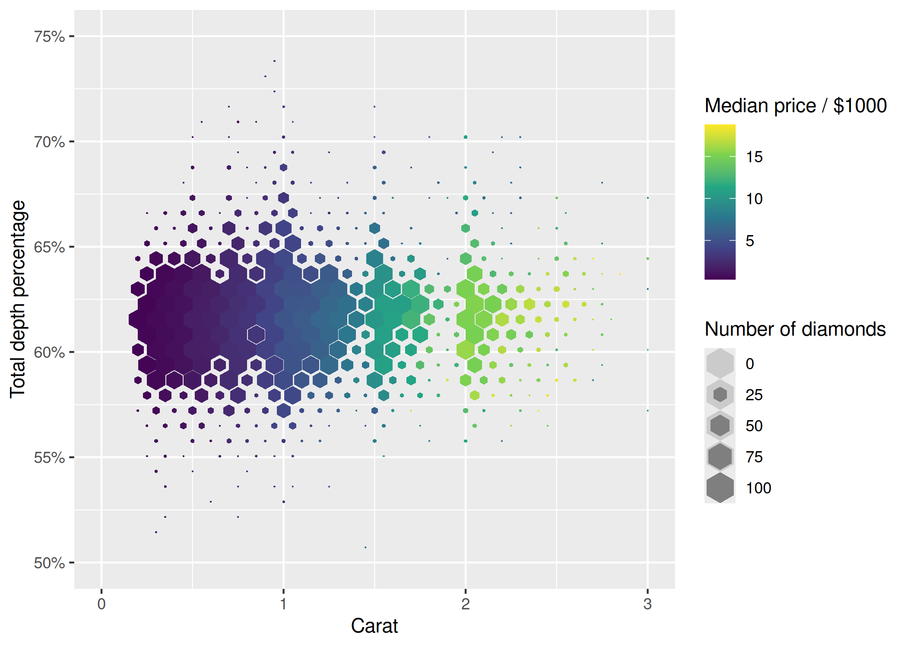
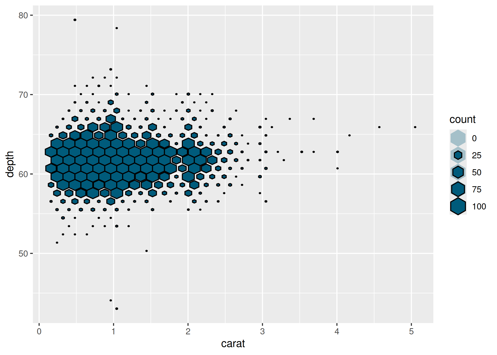
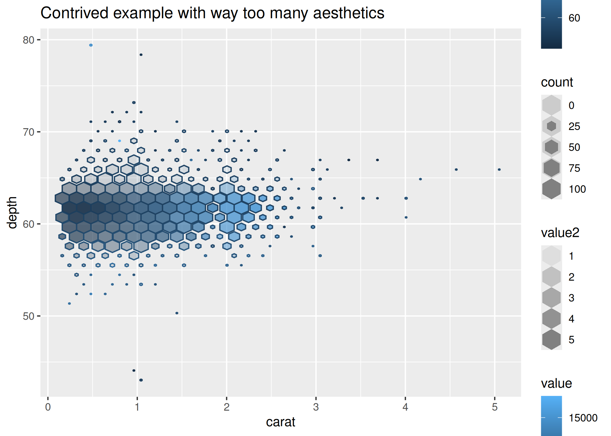

<!-- README.md is generated from README.Rmd. Please edit that file -->

# gghexsize

<!-- badges: start -->
<!-- badges: end -->

The goal of gghexsize is to …

## Installation

You can install the development version of gghexsize from
[GitHub](https://github.com/) with:

``` r
# install.packages("pak")
pak::pak("hrryt/gghexsize")
```

## Example

This is a basic example of a hexagonal heatmap of diamond prices:

``` r
library(ggplot2)
library(gghexsize)

p <- ggplot(diamonds, aes(carat, depth, z = price)) +
  scale_x_continuous(
    name = "Carat",
    limits = c(0, 3)
  ) +
  scale_y_continuous(
    name = "Total depth percentage",
    label = ~sprintf("%i%%", .x),
    limits = c(50, 75)
  ) +
  scale_fill_viridis_c(
    name = "Median price / $1000",
    label = ~.x / 1000
  )
```

The size of each hexagon scales with number of cases by default.

Use `scale_size_tile()` to scale size between 0 and 1, with values
outside the limits being ‘squished’ to the nearest limit.

The hextile key glyph includes a transparent background hexagon of size
1 for easy perceptual comparison with maximally tiled hexagons:

``` r
p +
  geom_hextile(fun = "median", na.rm = TRUE) +
  scale_size_tile(name = "Number of diamonds", limits = c(0, 100))
```



The statistic paired with `geom_hextile()`, `stat_summary_hextile()`,
offers all the aesthetics and computed variables of `stat_bin_hex()`
(and of `stat_summary_hex()`):

``` r
p +
  geom_hextile(
    aes(weight = price, size = after_stat(ndensity)),
    fun = "median", na.rm = TRUE
  ) +
  scale_size_tile(name = "Price-weighted density", limits = c(0, 0.1))
```


You can provide between 0 and 3 `z` aesthetics to
`stat_summary_hextile()`:

``` r
ggplot(diamonds, aes(carat, depth, fill = NULL)) +
  geom_hextile(colour = "black", fill = scales::muted("lightblue")) +
  scale_size_tile(limits = c(0, 100))
```



``` r

ggplot(diamonds, aes(
  carat, depth, z = price, z2 = as.numeric(cut), z3 = table, group = 1,
  alpha = after_stat(value2), colour = after_stat(value3)
)) + 
  geom_hextile() +
  scale_size_tile(limits = c(0, 100)) +
  labs(title = "Contrived example with way too many aesthetics")
```


